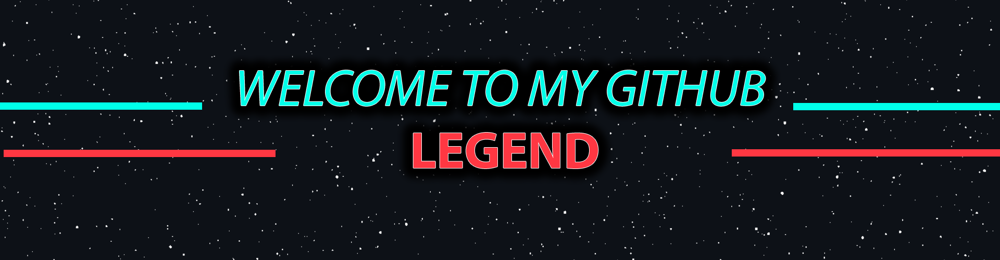

# $$\color{#ff3742}{Hello} \space {I'm} \space {Mahdi}$$

I'm a 23-year-old **$\color{#06f5de}{Full-Stack} \space {Application} \space {and} \space {Web} \space {Developer}$** who started learning how to code in **$\color{#06f5de}{2021}$**, my journey started with **$\color{#06f5de}{C++}$** which led me to learn one of the most famouse frameworks which is called $\color{#06f5de}{QT}$, my vision and thirst of learning didn't stop there.
I decided to learn $\color{#06f5de}{Web} \space {Development}$ the decision that helped me to have better understanding of coding.

## $$\color{#ff3742}{My} \space {Skills}$$

### $${\color{#ff3742}{Side} \space {Skills}}$$
### $$\color{#06f5de}{Adobe} \space {Premiere} \space \color{#ff3742}{|} \space \color{#06f5de}{Photoshop} \space \color{#ff3742}{|} \space \color{#06f5de}{Illustrator}$$

```cpp
std::cout << "If you think your life is hard, try to learn c++ on your own" << std::endl;
```
```js
console.log("If you wanna enjoy your life in the happy world of dummies, learn a high-end programming language");
```
```html
<h1> Am I right? </h1>
```
