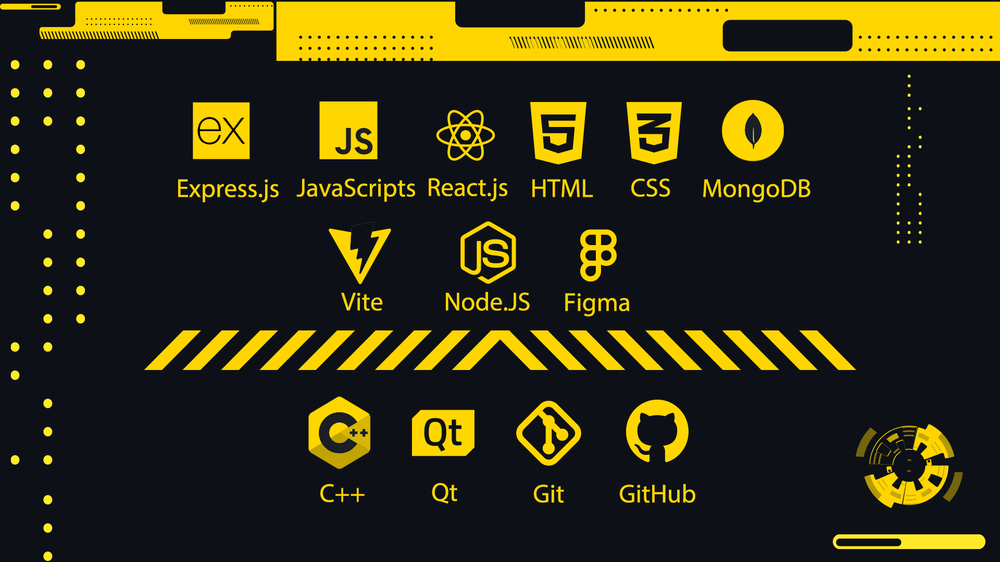

<h1 align="center"> $$\color{#FFD600} \textbf{Hello} \space \textbf{I'm} \space \textbf{Mahdi}$$ </h1>

I'm a 24-year-old **$\color{#FFD600}\textbf{Full-Stack} \space \textbf{Web} \space \textbf{and} \space \textbf{C++ } \textbf{Developer}$**. As I started learning how to code in **$\color{#FFD600} \textbf{2021}$** by digging into **$\color{#FFD600} 
 \textbf{C++}$** I found my way to the world of programmers. My curiosity didn't stop there and led me to the path of $\color{#FFD600}\textbf{Web Development}$, since I'd already known C++ it wasn't challanging to learn syntax of $\color{#FFD600}\textbf{JS}$, $\color{#FFD600}\textbf{CSS}$ and $\color{#FFD600}\textbf{HTML}$  but took me a while to learn the concepts of it.
Web development helped me to go deeper into programming and gave me the ambition of following my childhood dream, becoming a $\color{#FFD600} \textbf{} \space \textbf{Game Developer}$ in the future.

<h2 align="center" > $$\color{#FFD600} \textbf{My} \space \textbf{Skills}$$ </h2>
 

<h3 align="center"> $${\color{#FFD600} \textbf{Side} \space \textbf{Skills}}$$ </h3>

<h3 align="center"> $$\color{#FFD600}\textbf{Adobe} \space \textbf{Premiere} \space \color{#FFD600} \textbf{|} \space \color{#FFD600} \textbf{Photoshop} \space \color{#FFD600} \textbf{|} \space \color{#FFD600} \textbf{Illustrator}$$ </h3>

```cpp
std::cout << "If you think your life is hard, try to learn c++ on your own" << std::endl;
```
```js
console.log("If you wanna enjoy your life in the happy world of dummies, learn a high-end programming language");
```
```html
<h1> Am I right? </h1>
```
