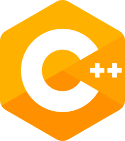
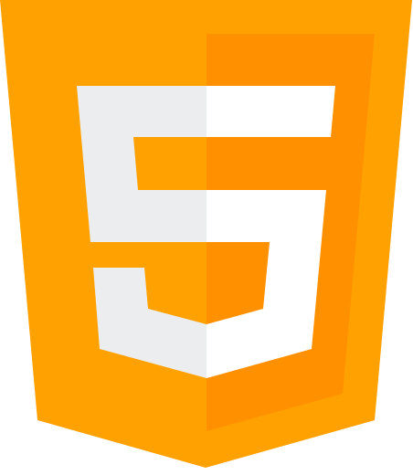
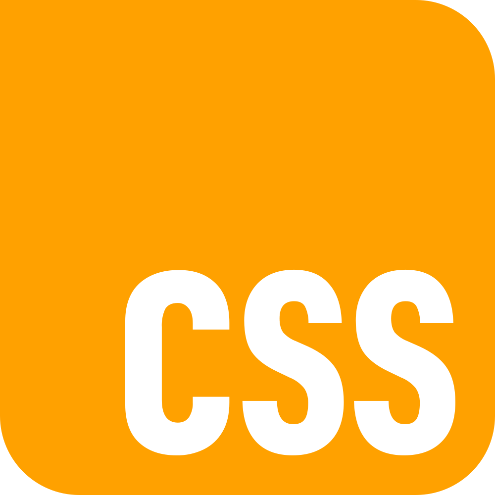
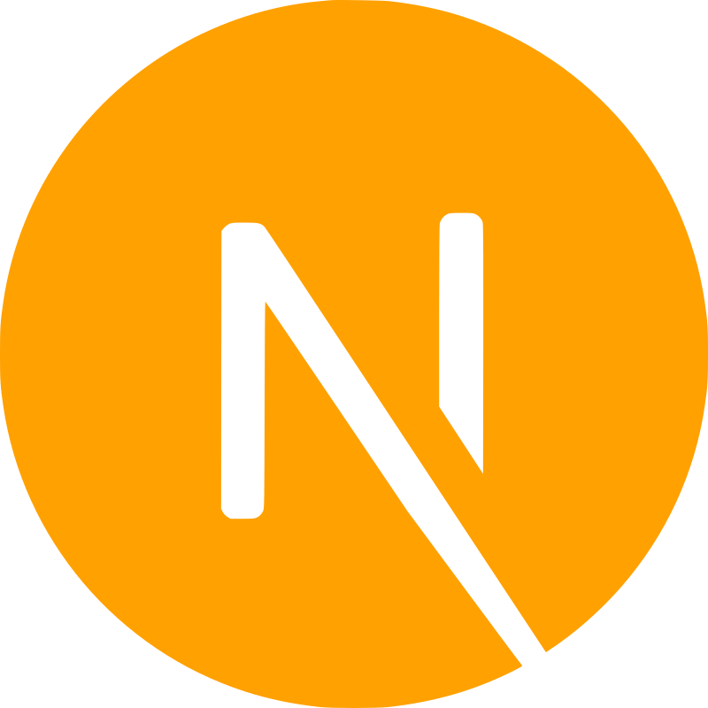
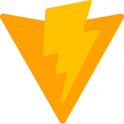
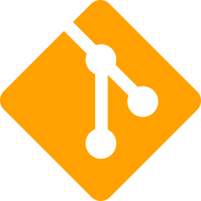
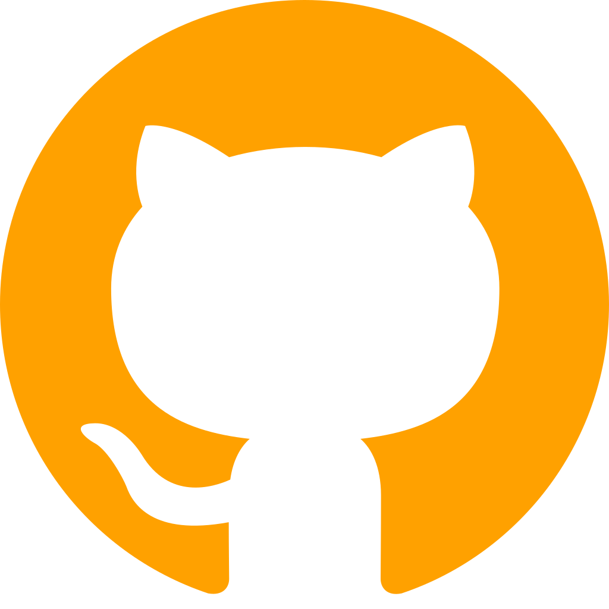

<h1 align="center">
      Hi, I'm (Matthew) Mahdi
</h1>


<p>
   I'm a 24-year-old <strong><code style="color: #FFB80">Full-Stack web and C++ developer</code></strong>. As I started learning how to code in 2021 by digging into <strong><code style="color: #FFB80">C++</code></strong>
   I found my way to the world of programmers. My curiosity didn't stop there and led me to the path of <strong><code style="color: #FFB80">Web Development</code></strong>, since I'd already known C++ it wasn't challenging to learn syntax of <strong><code style="color: #FFB80">JS</code></strong>
   , <strong><code style="color: #FFB80">CSS</code></strong> and <strong><code style="color: #FFB80">HTML</code></strong>
   but took me a while to get a deep understanding of how everything works.
   Web development helped me to go deeper into programming and gave me the ambition of following my childhood dream, becoming a <strong><code style="color: #FFB80">Game Developer</code></strong> in the future.
</p>


   <h2 align="center" >My Skills</h2>
    

   <table align="center">
      <tr>
         <td align="center">
            
            <p align="center">
               C++
            </p>
         </td>
         <td align="center">
            
            <p>
               JavaScript
            </p>
         </td>
         <td align="center">
            
            <p align="center">
               HTML
            </p>
         </td>
         <td align="center">
            
            <p align="center">
               CSS
            </p>
         </td>
      </tr>
      <tr>
         <td align="center">
            
            <p align="center">
               Express.js
            </p>
         </td>
         <td align="center">
            
            <p align="center">
               Node.js
            </p>
         </td>
         <td align="center">
            
            <p align="center">
               MongoDB
            </p>
         </td>
         <td align="center">
            
            <p align="center">
               Next.js
            </p>
         </td>
      </tr>
      <tr>
         <td align="center">
            
            <p align="center">
               React.js
            </p>
         </td>
         <td align="center">
            
            <p align="center">
               Three.js
            </p>
         </td>
         <td align="center">
            
            <p align="center">
               Tailwind
            </p>
         </td>
         <td align="center">
            
            <p align="center">
               Vite
            </p>
         </td>
      </tr>
      <tr>
         <td align="center">
            
            <p align="center">
               Figma
            </p>
         </td>
         <td align="center">
            
            <p align="center">
               Git
            </p>
         </td>
         <td align="center">
            
            <p align="center">
               GitHub
            </p>
         </td>
      </tr>
   </table>

---
<div align="center">
 
 

</div>

```cpp
#include <string>
#include <vector>


struct User {
    std::string status;
    std::string attitude;
    bool isFailed;

    User()
       :status("Trying"), attitude("Consistent"), isFailed(false) {}
};

int main(){
     std::vector<std::string> life = {"Challenge", "Failure", "Miserableness" };
     User user;

     while(user.status == "Trying"){
         if(user.attitude == "Consistent"){
              if(life.empty())
                 life.pop_back();
              else break;
         }
         else{
             user.isFailed = true;
             break;
         }
    }
}
```
```js
const Ego = document.querySelector("Ego");

Ego.addEventListener("Listening", () =>{
return user = "a real loser"
})

```
```html
<h1> I think the above codes said enough. </h1>
```
