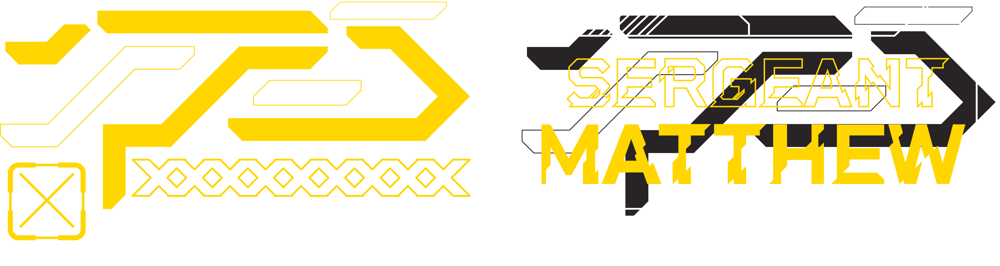
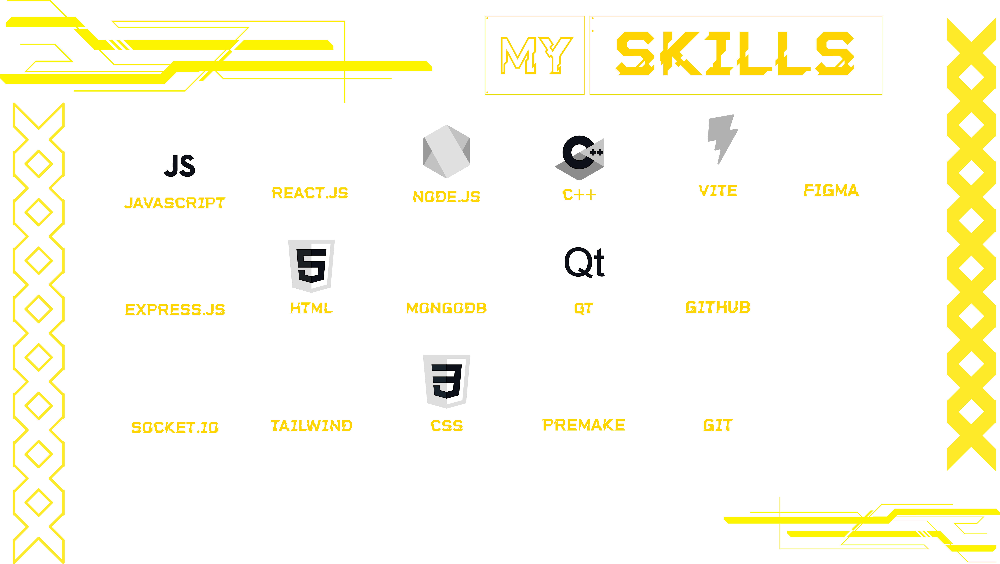

<h1 align="center">
   Hi, I'm (Matthew) Mahdi
</h1>

I'm a 24-year-old **<code>Full-Stack web and C++ developer</code>**. As I started learning how to code in 2021 by digging into 
<span>
   
</span>
I found my way to the world of programmers. My curiosity didn't stop there and led me to the path of **<code>Web Development</code>**, since I'd already known C++ it wasn't challanging to learn syntax of 
<span>
   
   </span>
, <span>
   
</span> and 
<span>
   
</span>
but took me a while to get a deep understanding of how everthing works.
Web development helped me to go deeper into programming and gave me the ambition of following my childhood dream, becoming a **<code>Game Developer</code>** in the future.

<h2 align="center" >My Skills</h2>
 

<h3 align="center"> Other Skills </h3>

<h3 align="center"> 
<span>
   
</span> | <span>
   
</span> | <span>
   
</span> </h3>

---
<div align="center">
 
 

</div>

```cpp
std::vector<std::string> life;

life.push_back("Challange");
life.push_back("Failure");
life.push_back("Miserableness");

while(user.status == "Trying"){
     if(user.attitude == "Consistant"){
          life.pop_back();
     }else{
          user.isFailed = true;
     }
}
```
```js
const Ego = document.querySelector("Ego");

Ego.addEventListener("Listening", () =>{
return user = "a real loser"
})

```
```html
<h1> I think the above codes said enough. </h1>
```
