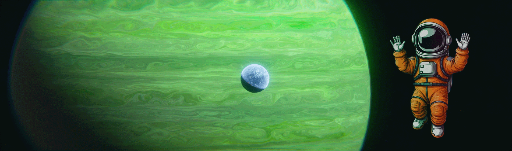

# $$\color{#c14b09}{Hello} \space {I'm} \space {Mahdi}$$

I'm a 23-year-old **$\color{#c14b09}{Full-Stack} \space {Application} \space {and} \space {Web} \space {Developer}$** who started learning how to code in **$\color{#c14b09}{2021}$**, my journey started with **$\color{#c14b09}{C++}$** which led me to learn one of the most famouse frameworks which is called $\color{#c14b09}{QT}$, my vision and thirst of learning didn't stop there.
I decided to learn $\color{#c14b09}{Web} \space {Development}$ the decision that helped me to have better understanding of coding.

## $$\color{#c14b09}{My} \space {Skills}$$

### $\color{#ffffff}{C++} \space \color{#fff200}{|} \space \color{#ffffff}{QT} \space \color{#fff200}{|} \space \color{#ffffff}{JS} \space \color{#fff200}{|} \space \color{#ffffff}{HTML} \space \color{#fff200}{|} \space \color{#ffffff}{CSS} \space \color{#fff200}{|} \space \color{#ffffff}{MONGODB} \space \color{#fff200}{|} \space \color{#ffffff}{EXPRESS} \space \color{#fff200}{|} \space \color{#ffffff}{NODE.JS} \space \color{#fff200}{|} \space \color{#ffffff}{REACT}$
### $\color{#ffffff}{Adobe Premiere} \space \color{#fff200}{|} \space \color{#ffffff}{Photoshop} \space \color{#fff200}{|} \space \color{#ffffff}{Illustrator}$

```cpp
std::cout << "If you think your life is hard, try to learn c++ on your own" << std::endl;
```
```js
console.log("If you wanna enjoy your life in the happy world of dummies, learn a high-end programming language");
```
```html
<h1> Am I right? </h1>
```
<!--
**SergeantMahdi/SergeantMahdi** is a ✨ _special_ ✨ repository because its `README.md` (this file) appears on your GitHub profile.

Here are some ideas to get you started:

- 🔭 I’m currently working on ...
- 🌱 I’m currently learning ...
- 👯 I’m looking to collaborate on ...
- 🤔 I’m looking for help with ...
- 💬 Ask me about ...
- 📫 How to reach me: ...
- 😄 Pronouns: ...
- ⚡ Fun fact: ...
-->
