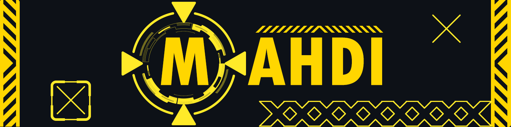
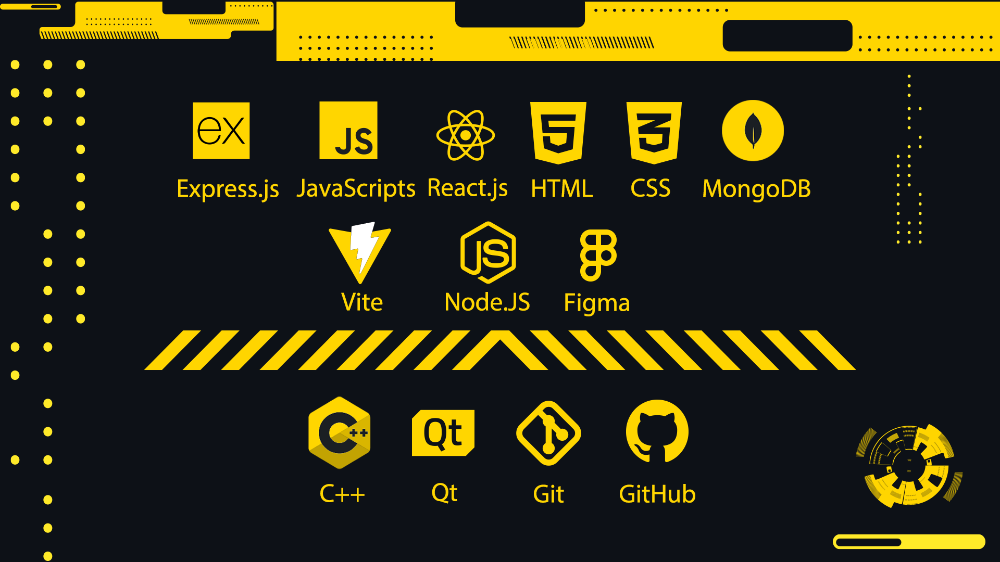

<h1 align="center"> $$\color{#FFD600}{Hello} \space {I'm} \space {Mahdi}$$ </h1>

I'm a 23-year-old **$\color{#FFD600}{Full-Stack} \space {Application} \space {and} \space {Web} \space {Developer}$** who started learning how to code in **$\color{#FFD600}{2021}$**, my journey started with **$\color{#FFD600}{C++}$** which led me to learn one of the most famouse frameworks which is called $\color{#FFD600}{QT}$, my vision and thirst of learning didn't stop there.
I decided to learn $\color{#FFD600}{Web} \space {Development}$ the decision that helped me to have better understanding of coding.

<h2 align="center"> $$\color{#FFD600}{My} \space {Skills}$$ </h2>
 

<h3 align="center"> $${\color{#FFD600}{Side} \space {Skills}}$$ </h3>

<h3 align="center"> $$\color{#FFD600}{Adobe} \space {Premiere} \space \color{#FFD600}{|} \space \color{#FFD600}{Photoshop} \space \color{#FFD600}{|} \space \color{#FFD600}{Illustrator}$$ </h3>

```cpp
std::cout << "If you think your life is hard, try to learn c++ on your own" << std::endl;
```
```js
console.log("If you wanna enjoy your life in the happy world of dummies, learn a high-end programming language");
```
```html
<h1> Am I right? </h1>
```
